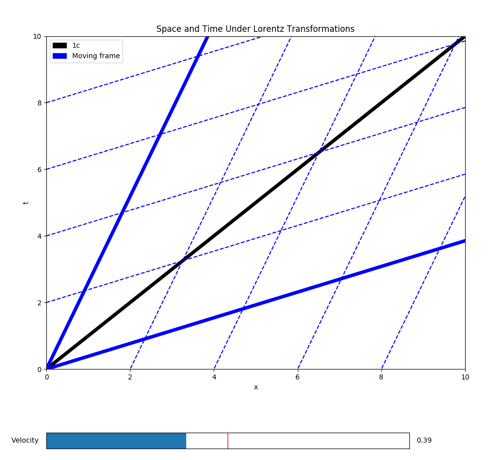

# Lorentz-Transformations

This program plots time and space axes for a moving observer using Lorentz Transformation to account for special relativistic effects.  Use the velocity slider to see what happens to space and time as an observer gets closer to the speed of light.  An example output is below.

